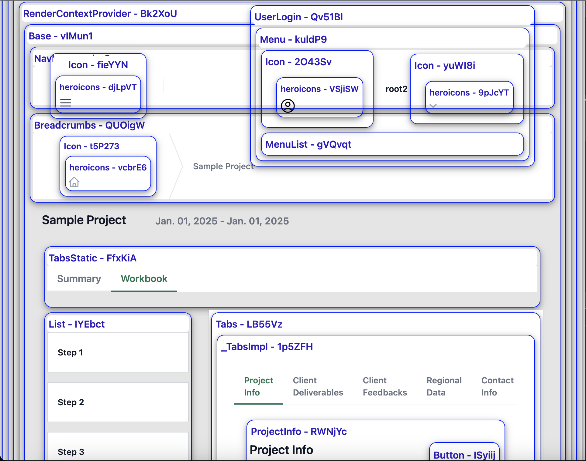
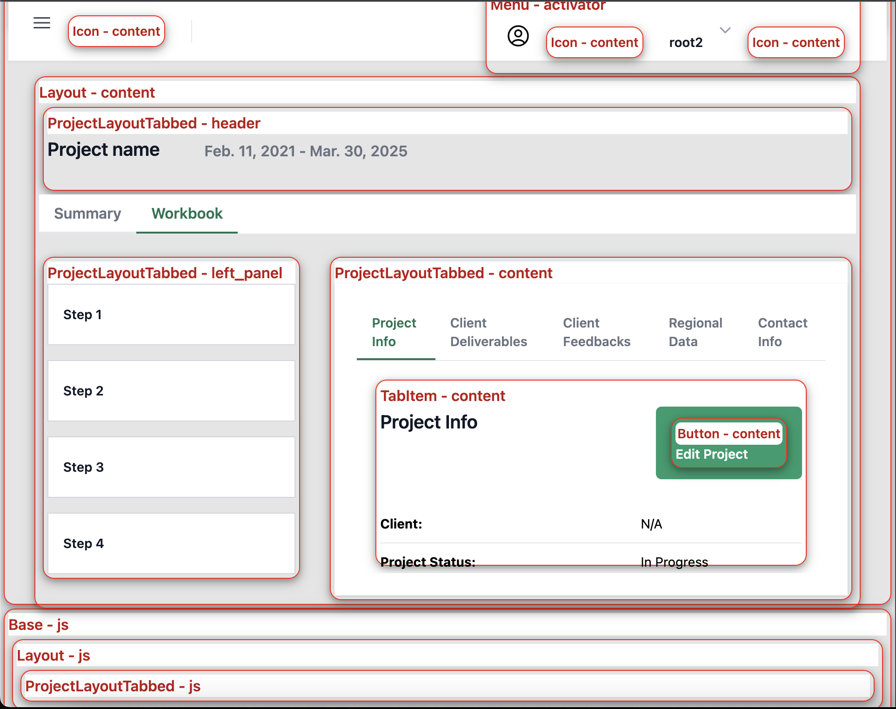

As larger projects get more complex, it can be hard to debug issues. Django Components provides a number of tools and approaches that can help you with that.

## Component and slot highlighting

Django Components provides a visual debugging feature that helps you understand the structure and boundaries of your components and slots. When enabled, it adds a colored border and a label around each component and slot on your rendered page.

To enable component and slot highlighting, set
[`debug_highlight_components`](../../../reference/settings/#django_components.app_settings.ComponentsSettings.debug_highlight_components)
and/or [`debug_highlight_slots`](../../../reference/settings/#django_components.app_settings.ComponentsSettings.debug_highlight_slots)
to `True` in your `settings.py` file:

```python
from django_components import ComponentsSettings

COMPONENTS = ComponentsSettings(
    debug_highlight_components=True,
    debug_highlight_slots=True,
)
```

Components will be highlighted with a **blue** border and label:



While the slots will be highlighted with a **red** border and label:



!!! warning

    Use this feature ONLY in during development. Do NOT use it in production.

## Component path in errors

When an error occurs, the error message will show the path to the component that
caused the error. E.g.

```
KeyError: "An error occured while rendering components MyPage > MyLayout > MyComponent > Childomponent(slot:content)
```

The error message contains also the slot paths, so if you have a template like this:

```django

    
        
            
                
                    ...  {# ERROR HERE #}
                
            
        
    

```

Then the error message will show the path to the component that caused the error:

```
KeyError: "An error occured while rendering components my_page > layout > layout(slot:content) > my_page(slot:content) > table > table(slot:header) > table_header > table_header(slot:content)
```

## Debug and trace logging

Django components supports [logging with Django](https://docs.djangoproject.com/en/5.0/howto/logging/#logging-how-to).

To configure logging for Django components, set the `django_components` logger in
[`LOGGING`](https://docs.djangoproject.com/en/5.1/ref/settings/#std-setting-LOGGING)
in `settings.py` (below).

Also see the [`settings.py` file in sampleproject](https://github.com/django-components/django-components/blob/master/sampleproject/sampleproject/settings.py) for a real-life example.

```py
import logging
import sys

LOGGING = {
    'version': 1,
    'disable_existing_loggers': False,
    "handlers": {
        "console": {
            'class': 'logging.StreamHandler',
            'stream': sys.stdout,
        },
    },
    "loggers": {
        "django_components": {
            "level": logging.DEBUG,
            "handlers": ["console"],
        },
    },
}
```

!!! info

    To set TRACE level, set `"level"` to `5`:

    ```py
    LOGGING = {
        "loggers": {
            "django_components": {
                "level": 5,
                "handlers": ["console"],
            },
        },
    }
    ```

### Logger levels

As of v0.126, django-components primarily uses these logger levels:

- `DEBUG`: Report on loading associated HTML / JS / CSS files, autodiscovery, etc.
- `TRACE`: Detailed interaction of components and slots. Logs when template tags,
  components, and slots are started / ended rendering, and when a slot is filled.

## Slot origin

When you pass a slot fill to a Component, the component and slot names is remebered
on the slot object.

Thus, you can check where a slot was filled from by printing it out:

```python
class MyComponent(Component):
    def on_render_before(self):
        print(self.input.slots)
```

might print:

```txt
{
    'content': <Slot component_name='layout' slot_name='content'>,
    'header': <Slot component_name='my_page' slot_name='header'>,
    'left_panel': <Slot component_name='layout' slot_name='left_panel'>,
}
```
